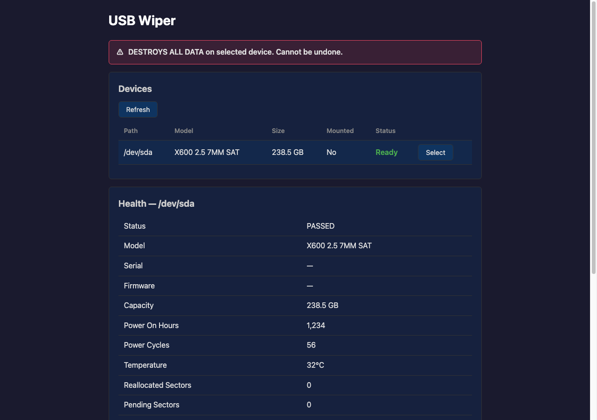

# USB Wiper

Securely wipe USB storage devices from your browser.



## Features

- **Secure Wipe** — Single-pass zero write across the entire USB device with verification.
- **SMART Health** — Display device health information (power-on hours, temperature, reallocated sectors, etc.)
- **Web UI** — Minimal web interface with real-time progress tracking via SSE.
- **Auto-Format** — Optional FAT32 formatting after wipe.
- **Docker** — Runs as a single container with no external dependencies.
- **Multi-arch** — `linux/amd64` and `linux/arm64` images available on Docker Hub.

## Quick Start

### Option 1: Pull from Docker Hub (Recommended)

```bash
docker run --rm -it --privileged \
  -v /dev:/dev \
  -v /sys:/sys:ro \
  -p 8080:8080 \
  michealchoudhary/usb-wiper:latest
```

Open [http://localhost:8080](http://localhost:8080) in your browser.

Available image tags: `latest`, `v0.1.0`, `0.1`, `0`

### Option 2: Docker compose

Create a `docker-compose.yml`:

```yaml
services:
  usb-wiper:
    image: michealchoudhary/usb-wiper:latest
    container_name: usb-wiper
    privileged: true
    volumes:
      - /dev:/dev
      - /sys:/sys:ro
    ports:
      - "8080:8080"
    environment:
      - UNSAFE_ALLOW_ALL_USB=1
      - LOG_LEVEL=info
    restart: unless-stopped
```

```bash
docker compose up -d
```

### Option 3: Clone and build

```bash
git clone https://github.com/michealch/usb-wiper.git
cd usb-wiper
make prod
```

### Option 4: Run without Docker (Linux only)

```bash
# Requirements: Go 1.26+, smartmontools, dosfstools, parted, util-linux

make build
sudo UNSAFE_ALLOW_ALL_USB=1 ./bin/usb-wiper
```

## Environment Variables

| Variable                | Default | Description                                                        |
|-------------------------|---------|--------------------------------------------------------------------|
| `PORT`                  | `8080`  | HTTP port the server listens on                                    |
| `LOG_LEVEL`             | `info`  | Log level: `debug`, `info`, `warn`, `error`                        |
| `UNSAFE_ALLOW_ALL_USB`  | (unset) | Set to `1` to skip the removable-device check for USB SSDs/enclosures |

### When to use `UNSAFE_ALLOW_ALL_USB=1`

Some USB SSD enclosures (especially UASP-capable ones) report `removable=0` in sysfs even though they're physically connected via USB. When this happens, the device appears in the list but shows "⚠ Blocked" and cannot be wiped. Set `UNSAFE_ALLOW_ALL_USB=1` to bypass only the removable flag check. **All other safety checks remain active** (USB bus, system mount points, root device, size limit, etc.).

## ⚠️ Safety Warnings

- **THIS TOOL DESTROYS ALL DATA** on the selected USB device. Recovery is impossible.
- **Only USB devices** are shown. System disks (NVMe, SATA, etc.) are filtered.
- The application performs **9 independent safety checks** before allowing any destructive operation:
  1. Path must match `/dev/sd[a-z]`
  2. Device must exist
  3. Must be a block device
  4. Must not be NVMe
  5. Must not be the root device
  6. Must be marked as removable (skipped when `UNSAFE_ALLOW_ALL_USB=1`)
  7. Must be on a USB bus
  8. Must not be mounted at a system path (`/`, `/boot`, `/home`, `/var`, `/usr`, `/etc`)
  9. Size must be ≤ 2 TB
- **Run inside Docker** for additional isolation.
- **Do not use on production servers** unless you fully understand the risks.

## API Reference

| Method | Path                  | Description              |
|--------|-----------------------|--------------------------|
| GET    | `/api/devices`        | List USB devices         |
| GET    | `/api/health?device=X`| SMART health info        |
| POST   | `/api/wipe`           | Start wipe               |
| POST   | `/api/cancel`         | Cancel active wipe       |
| GET    | `/api/job`            | Current job status       |
| GET    | `/api/config`         | Get configuration        |
| POST   | `/api/config`         | Update configuration     |
| GET    | `/api/events`         | SSE progress stream      |
| GET    | `/healthz`            | Health check             |

### POST /api/wipe

```json
{
  "device": "/dev/sdb",
  "autoFormat": false
}
```

## Development

```bash
# Requirements: Go 1.26+, Docker, docker compose v2

make build        # Build local binary
make test         # Run tests with race detector
make test-verbose # Run tests with verbose output
make fmt          # Format code
make vet          # Run go vet
make lint         # Run linter (requires golangci-lint)
make tidy         # Run go mod tidy
make dev          # Dev server with hot reload
make docker-build # Build Docker image
make docker-run   # Build and run Docker image
make prod         # Production deployment
make stop         # Stop all compose services
make logs         # Tail container logs
make shell        # Shell into running container
make clean        # Remove build artifacts
```

## Architecture

```
cmd/usb-wiper/         → Entry point
internal/
  device/              → USB detection, safety checks, SMART
  wipe/                → Zero-write engine, progress tracking
  format/              → FAT32 formatting
  config/              → In-memory configuration
  server/              → HTTP server, SSE hub, handlers
  server/static/       → Embedded web UI (HTML, CSS, JS)
```

## Technology Stack

- **Go 1.26+** (stdlib only, no external dependencies)
- **Plain HTML5 + vanilla JS + CSS** (no frameworks)
- **Server-Sent Events** for real-time progress
- **Docker** with Alpine Linux
- **Multi-arch** images (AMD64 + ARM64) on Docker Hub
- **MIT License**

## License

MIT License — see [LICENSE](LICENSE) for details.
